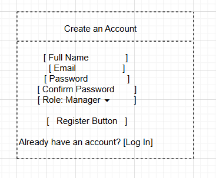
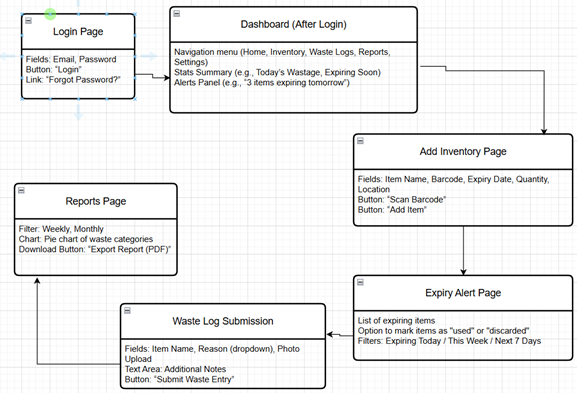
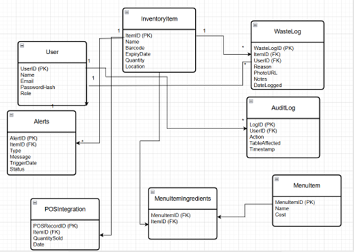
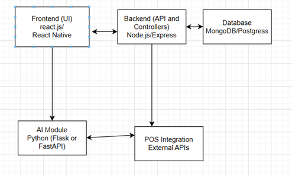

# WasteWise – Project Progress Report 1

## 📌 Overview
WasteWise is a smart inventory and waste management system for restaurants. It uses AI forecasting, expiry alerts, and waste tracking to reduce food waste and improve efficiency. This report expands on the original proposal with detailed design and technical documentation.

## 🗒 Detailed User Stories
 

| User Story ID | User Story |
|---------------|---------------|
| US-01 | As a restaurant manager, I want to log into the WasteWise system, so that I can access and manage inventory and waste data securely. |
| US-02 | As a kitchen staff member, I want to scan a product's barcode, so that I can quickly add it to the inventory system. |
| US-03 | As a kitchen staff member, I want to receive expiry alerts, so that I can use ingredients before they go bad. |
| US-04 | As a restaurant manager, I want to view weekly waste reports, so that I can monitor food wastage trends. |
| US-05 | As a staff member, I want to upload a food waste entry with a photo and reason, so that it can be logged properly. |
| US-06 | As a restaurant manager, I want to get restocking suggestions from the AI module, so that I order the right quantity of supplies. |
| US-07 | As a manager, I want to generate and download audit reports, so that I can comply with regulations. |
| US-08 | As a chef, I want to see which ingredients are close to expiry, so that I can prioritize them in food preparation. |
| US-09 | As a manager, I want to track ingredient costs by menu item daily, so that I can monitor profitability. |
| US-10 | As a staff member, I want the system to sync with the POS, so that inventory updates automatically after a sale. |

## 🖼 Wireframes

a. This is the screen where a new user creates an account. 

b. Wireframe Flow – Login, Dashboard, Inventory, Alerts, Waste Log & Reports.

## 🗄 Database Schema

## 🏗 Software Architecture

## 🤖 AI Component
The AI module, built in Python with Scikit-learn, TensorFlow, and FastAPI, provides:
- **Demand Forecasting** – Predicts stock needs from sales/waste history.
- **Waste Analysis** – Detects patterns and suggests fixes.
- **Expiry Prioritization** – Smart alerts based on expiry and usage trends.
- **Restocking Guidance** – POS-driven, seasonal-aware recommendations.  
Integrated as a microservice, it sends predictions to the backend and displays actionable insights on the dashboard.

## 🛠 Tools & Platforms
- **Version Control**: GitHub  
- **Tracking Tool**: Microsoft Planner  
- **Testing**: Jest, Mocha, Postman, Supertest  

## 🧪 Test Plan
Covers:
- Unit, Integration, Functional, and UAT  
Example UAT: Verify expiry alerts when item expiry ≤ 1 day.

## 📂 Tracking
All tasks are managed in **Microsoft Planner**, with buckets for each module, assigned owners, and tracked progress toward deadlines.
